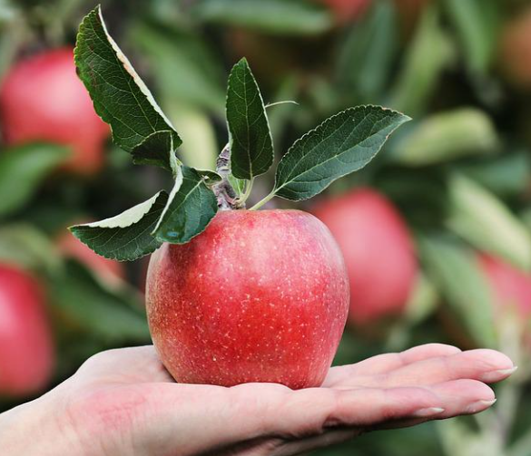

import ReactPlayer from "react-player";

:::tip

This is a normal Notion Callout

:::

## Columns {#fe189ddc38164dee90b57aac9545c1c5}

There should be text on the left, and an apple on the right.

A paragraph on the left.

Another paragraph.

## Embedded YouTube: {#061c03eee8d4449fa119c1ee9557f261}

<ReactPlayer controls url="https://www.youtube.com/watch?v=VjINuQX4hbM" />

## Heading Links {#3ba63961e7bc48469750836bd5820738}

Though Docusaurus doesn’t allow linking to heading 1 within their system (see [linking to a heading 1](/oranges) still works through docu-notion if we just code it up the same way as the others.

- Link to a [heading 2](/oranges).
- Link to a [heading 3](/oranges).

## Tables {#a0308a393cf74c71bfbbf98adb4b132c}

| head 1        | head 2 |
| ------------- | ------ |
| who           | this   |
| what yeah | that   |

